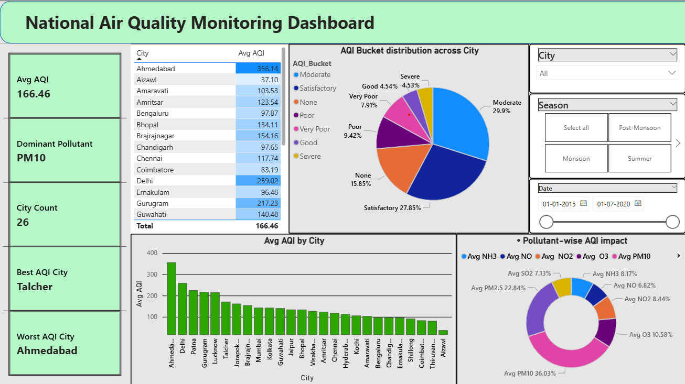

# Air Quality Index (AQI) Analysis Dashboard

An interactive **Power BI** dashboard designed to visualize and analyze Air Quality Index (AQI) data. This project provides insights into pollutant levels, regional air quality trends, and environmental health metrics.

## 📊 Project Overview
The goal of this dashboard is to transform raw environmental data into actionable insights, allowing users to track air quality fluctuations and identify high-pollution zones.

### 📈 Insights Preview

### Key Features:
* **Real-time AQI Tracking:** Visualizing the current state of air quality across different regions.
* **Pollutant Breakdown:** Detailed analysis of $PM_{2.5}$, $PM_{10}$, $NO_2$, and $CO$ levels.
* **Trend Analysis:** Time-series charts showing daily or monthly pollution patterns.
* **Geographic Mapping:** Interactive maps highlighting areas with critical AQI levels.

## 🛠️ Tools & Technologies
* **Power BI Desktop:** Used for data modeling, DAX calculations, and visualization.
* **Excel / Power Query:** Data cleaning and transformation performed on `aqi_cleaned_data.xlsx`.

## 📁 Repository Structure
* **[HarshJadav_Aqi_dashboard_Batch7.pbix](HarshJadav_Aqi_dashboard_Batch7.pbix)**: The main Power BI project file.
* **[aqi_cleaned_data.xlsx](aqi_cleaned_data.xlsx)**: The dataset used for the analysis.
* **image.png**: Dashboard preview image.

## 🚀 How to View the Dashboard
1. Clone this repository or download the `.pbix` file.
2. Install [Power BI Desktop](https://powerbi.microsoft.com/desktop/).
3. Open `HarshJadav_Aqi_dashboard_Batch7.pbix` to explore the interactive reports.

---
Developed by [Harsh Jadav](https://github.com/jadavharsh109)
