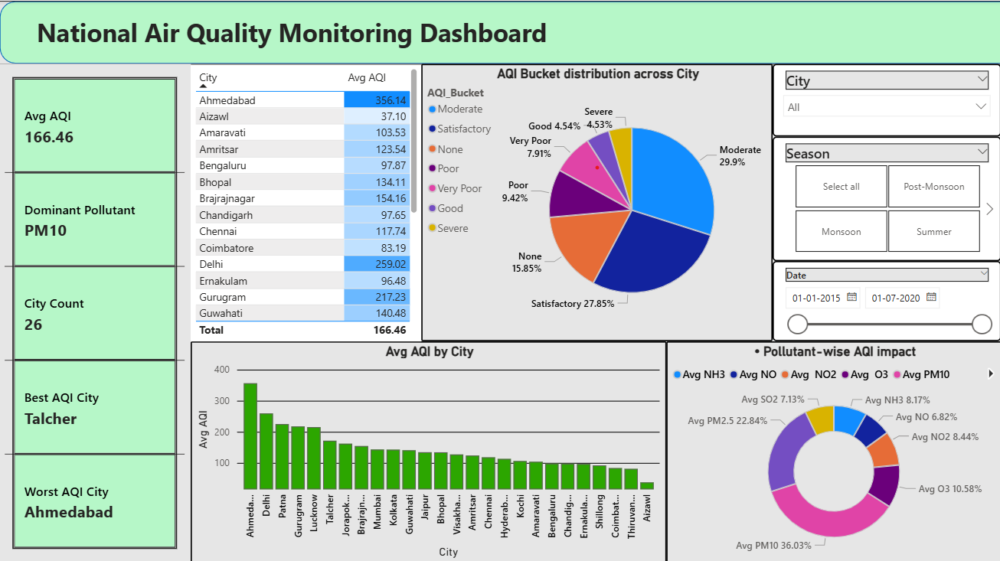
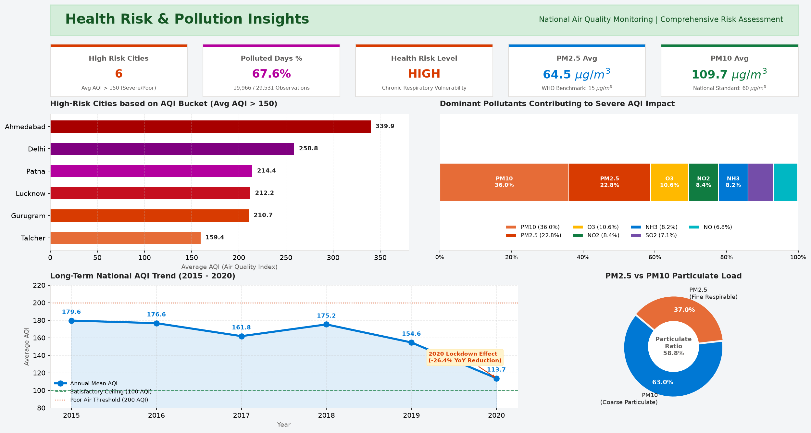
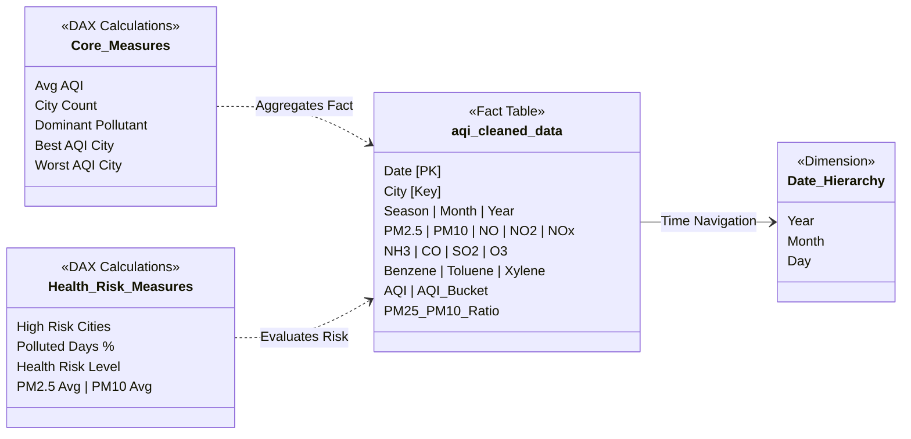

# 🌫️ National Air Quality Monitoring & Health Risk Analytics

[](https://powerbi.microsoft.com/)
[](https://learn.microsoft.com/en-us/dax/)
[](https://www.microsoft.com/excel)
[](LICENSE)
[](https://www.linkedin.com/in/harshjadav0901/)

An executive-grade **Power BI Business Intelligence & Environmental Risk Analytics** solution tracking and diagnosing Air Quality Index (AQI) patterns across **26 Indian metropolitan and industrial hubs** spanning **2015 to 2020**.

This project provides multi-level analytical perspectives—from national aggregate performance and pollutant chemical composition to city-specific risk categorization and long-term multi-year trends.

---

## 📌 Executive Summary & Key Performance Indicators (KPIs)

| Metric | Value | Analytical Context |
|:---|:---:|:---|
| **Total Observations** | **29,531** | Daily records cleaned, normalized, and validated across 5.5 years |
| **Monitored Metros** | **26 Cities** | Covering major northern, southern, western, and north-eastern clusters |
| **Temporal Span** | **2015 – 2020** | Multi-year chronological data capturing seasonal cycles & policy interventions |
| **National Mean AQI** | **166.46** | Classified within the **Moderate to Unhealthy** category |
| **Unhealthy Days Ratio** | **67.61%** | 19,966 days exceeding the 100 AQI satisfactory threshold |
| **High-Risk Cities** | **6 Cities** | Persistent average AQI $> 150$ (Ahmedabad, Delhi, Patna, Lucknow, Gurugram, Talcher) |
| **Dominant Contaminant** | **$\text{PM}_{10}$** | Primary particulate driver with an average of $109.66\,\mu\text{g/m}^3$ ($36.0\%$ AQI share) |
| **Cleanest Urban Center** | **Aizawl (36.24)** | Only monitored city sustaining consistent **Good** baseline AQI |
| **Lockdown Impact (2020)** | **$-26.4\%$** | National AQI plunged from $154.58$ (2019) to $113.74$ (2020) during lockdowns |

---

## 🖥️ Interactive Dashboard Tour

The Power BI report is architected across **two dedicated analytical pages**, each engineered for interactive cross-filtering, slicer drills, and executive diagnosis.

### Page 1: National Air Quality Monitoring Dashboard
> Provides macro-level environmental oversight, geographic rankings, pollutant shares, and multi-parameter slicing.



#### Key Dashboard Visuals:
- **Executive Metric Cards:** Real-time visibility into National Average AQI ($166.46$), Dominant Pollutant ($\text{PM}_{10}$), Total City Count ($26$), Best Performing City, and Worst Performing City.
- **City-Level AQI Performance Table & Column Chart:** Direct rank-ordered comparison highlighting the severe pollution gap between northern industrial hubs ($> 200$) and coastal/hilly regions ($< 100$).
- **AQI Bucket Distribution:** Proportional categorization showing Moderate ($29.9\%$), Satisfactory ($27.8\%$), Poor ($9.4\%$), Very Poor ($7.9\%$), and Severe ($4.5\%$) days.
- **Pollutant-Wise Impact Donut:** Relative share of 7 primary criteria pollutants ($\text{PM}_{10}$, $\text{PM}_{2.5}$, $\text{O}_3$, $\text{NO}_2$, $\text{NH}_3$, $\text{SO}_2$, $\text{NO}$).
- **Interactive Multi-Slicers:** Dynamic filtering by City, Season (`Winter`, `Summer`, `Monsoon`, `Post-Monsoon`), and Date Timeline slider.

---

### Page 2: Health Risk & Pollution Insights
> Explores chronic health exposure, particulate matter toxicity ratios, high-risk threshold breaches, and longitudinal multi-year trajectory.



#### Key Analytical Visuals:
- **Risk Assessment KPI Banner:** Displays the count of High-Risk Metros ($6$), percentage of Polluted Days ($67.6\%$), Overall Health Risk Level (**HIGH**), and average concentrations for $\text{PM}_{2.5}$ ($64.5\,\mu\text{g/m}^3$) and $\text{PM}_{10}$ ($109.7\,\mu\text{g/m}^3$).
- **High-Risk Cities Ranking (Avg AQI $> 150$):** Pinpoints the 6 chronic hot zones—led by Ahmedabad ($339.9$) and Delhi ($258.8$).
- **Dominant Pollutants Contributing to Severe AQI:** Component stacked analysis revealing that coarse ($\text{PM}_{10}$) and fine respirable ($\text{PM}_{2.5}$) particulates drive $58.8\%$ of total atmospheric toxicity.
- **Long-Term Multi-Year Trend (2015–2020):** Annual trajectory tracking national AQI with benchmark reference lines and COVID-19 lockdown impact analysis.
- **Particulate Load Ratio ($\text{PM}_{2.5}$ vs $\text{PM}_{10}$):** Visual breakdown of respirable fine particles vs coarse dust.

---

## 🏗️ Data Architecture & Modeling

The Power BI solution is structured around an efficient dimensional model designed for rapid querying and instantaneous slicer cross-filtering.


```mermaid
classDiagram
    direction LR
    class aqi_cleaned_data {
        <<Fact Table>>
        Date [PK]
        City [Key]
        Season | Month | Year
        PM2.5 | PM10 | NO | NO2 | NOx
        NH3 | CO | SO2 | O3
        Benzene | Toluene | Xylene
        AQI | AQI_Bucket
        PM25_PM10_Ratio
    }
    class Date_Hierarchy {
        <<Dimension>>
        Year
        Month
        Day
    }
    class Core_Measures {
        <<DAX Calculations>>
        Avg AQI
        City Count
        Dominant Pollutant
        Best AQI City
        Worst AQI City
    }
    class Health_Risk_Measures {
        <<DAX Calculations>>
        High Risk Cities
        Polluted Days %
        Health Risk Level
        PM2.5 Avg | PM10 Avg
    }

    aqi_cleaned_data --> Date_Hierarchy : Time Navigation
    Core_Measures ..> aqi_cleaned_data : Aggregates Fact
    Health_Risk_Measures ..> aqi_cleaned_data : Evaluates Risk
```

### Schema Attributes & Taxonomy

| Category | Attributes | Description |
|:---|:---|:---|
| **Geography & Time** | `City`, `Date`, `Month`, `Month2`, `Season`, `Year` | Geographic identifiers, calendar dimensions, and Indian seasonal classifications |
| **Particulates** | `PM2.5`, `PM10`, `PM25_PM10_Ratio` | Fine respirable particles ($\le 2.5\,\mu\text{m}$) and coarse inhalable dust ($\le 10\,\mu\text{m}$) |
| **Gaseous Pollutants** | `NO`, `NO2`, `NOx`, `NH3`, `CO`, `SO2`, `O3` | Criteria combustion by-products, vehicular emissions, and photochemical smog agents |
| **Volatile Organics** | `Benzene`, `Toluene`, `Xylene` | Industrial solvents, petrochemical emissions, and aromatic hydrocarbons |
| **Output Metrics** | `AQI`, `AQI_Bucket` | Calculated Air Quality Index and official CPCB toxicity classification buckets |

---

## 🧮 Core DAX Measures

The analytical insights and dynamic KPI cards are powered by custom **Data Analysis Expressions (DAX)**:

```dax
-- National Average AQI
Avg AQI = 
AVERAGE(AQI_Data[AQI])

-- Dynamic Unique City Counter
City Count = 
DISTINCTCOUNT(AQI_Data[City])

-- High-Risk Cities Filtered Threshold (Avg AQI > 150)
High Risk Cities = 
CALCULATE(
    DISTINCTCOUNT(AQI_Data[City]),
    FILTER(
        ALL(AQI_Data[City]),
        [Avg AQI] > 150
    )
)

-- Percentage of Unhealthy Days (Exceeding Satisfactory Benchmark of 100)
Polluted Days % = 
DIVIDE(
    CALCULATE(COUNTROWS(AQI_Data), AQI_Data[AQI] > 100),
    COUNTROWS(AQI_Data),
    0
)

-- Categorical Risk Indicator
Health Risk Level = 
SWITCH(
    TRUE(),
    [Avg AQI] >= 200, "CRITICAL",
    [Avg AQI] >= 150, "HIGH",
    [Avg AQI] >= 100, "MODERATE",
    "LOW"
)

-- Particulate Matter Averages
PM25 Avg = AVERAGE(AQI_Data[PM2.5])
PM10 Avg = AVERAGE(AQI_Data[PM10])
```

---

## 💡 Key Business & Environmental Findings

```
SEASONAL POLLUTION INVERSION PATTERN
========================================================================
Winter         ████████████████████████████████ 204.10 AQI (Peak Toxic)
Post-Monsoon   ███████████████████████ 173.43 AQI (Stubble/Festive)
Summer         ██████████████████ 143.36 AQI (Dust Storms)
Monsoon        ██████████████ 116.06 AQI (Precipitation Scrubbing)
========================================================================
```

1. **The Particulate Matter Crisis:**
   - $\text{PM}_{10}$ ($109.66\,\mu\text{g/m}^3$) and $\text{PM}_{2.5}$ ($64.51\,\mu\text{g/m}^3$) are the primary drivers of Indian urban air pollution, jointly accounting for **$58.8\%$** of criteria pollutant load.
   - $\text{PM}_{2.5}$ levels exceed the WHO annual safety guideline ($5\,\mu\text{g/m}^3$) by more than **$12\times$**, presenting severe chronic respiratory risks.

2. **Severe Winter Inversion ($+75.8\%$ vs Monsoon):**
   - Atmospheric inversion layers during November–February trap pollutants near ground level.
   - Winter averages **$204.10$ AQI** (Poor/Very Poor) compared to **$116.06$ AQI** during the Monsoon season, when heavy rain scrub particulate matter from the air.

3. **Geographical Divides & Chronic Hotspots:**
   - **Critical Belt:** Ahmedabad ($339.86$), Delhi ($258.78$), Patna ($214.41$), and Lucknow ($212.20$) sustain persistent unhealthy-to-severe air conditions driven by dense vehicular traffic, industrial zones, and landlocked geography.
   - **Clean Baseline Zones:** Aizawl ($36.24$), Shillong ($75.54$), and Coimbatore ($77.92$) leverage elevation, high green cover, and oceanic air circulation to maintain good air quality.

4. **The 2020 COVID-19 Lockdown Anomaly:**
   - Between 2015 and 2019, national average AQI hovered between $154.58$ and $179.62$.
   - In 2020, strict nationwide restrictions triggered an abrupt **$26.4\%$ YoY decline** down to **$113.74$**, providing empirical evidence of the rapid restorative capacity of industrial and transport emission controls.

---

## 📂 Repository Structure

```text
air-quality-powerbi-analytics/
├── assets/
│   ├── dashboard_overview.png               # Page 1: National Air Quality Monitoring preview
│   └── health_risk_insights.png             # Page 2: Health Risk & Pollution Insights preview
├── dashboards/
│   └── HarshJadav_Aqi_dashboard_Batch7.pbix # Interactive Power BI report file (DAX, visuals)
├── data/
│   └── aqi_cleaned_data.xlsx                # Cleaned multi-year environmental dataset (29.5k rows)
├── .gitignore                               # Excludes temporary Excel lockfiles & Power BI backups
├── LICENSE                                  # MIT Open-Source License
└── README.md                                # Executive project documentation & analysis
```

---

## 🚀 How to Open & Explore the Dashboard

1. **Prerequisites:** Install [Microsoft Power BI Desktop](https://powerbi.microsoft.com/desktop/) (free).
2. **Clone the Repository:**
   ```bash
   git clone https://github.com/jadavharsh109/air-quality-powerbi-analytics.git
   ```
3. **Open the Report:**
   - Navigate to `dashboards/` and double-click `HarshJadav_Aqi_dashboard_Batch7.pbix`.
   - Interact with the City, Season, and Date slicers to observe dynamic cross-filtering across all visuals.

---

## 👤 Author & Contact

**Harsh Jadav**  
*Data Analyst | Data Scientist*

[](https://www.linkedin.com/in/harshjadav0901/)
[](https://github.com/jadavharsh109)

---
*If you find this project insightful or useful for your environmental data research, feel free to star ⭐ this repository!*
